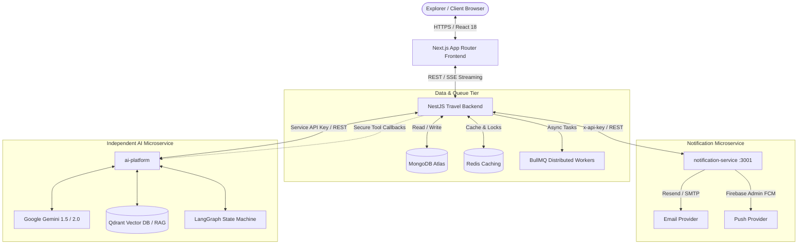
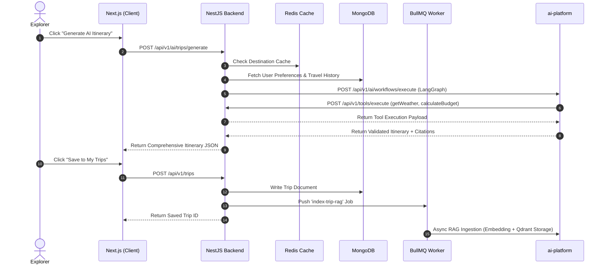
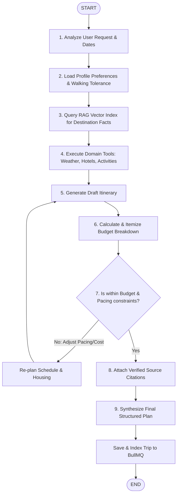
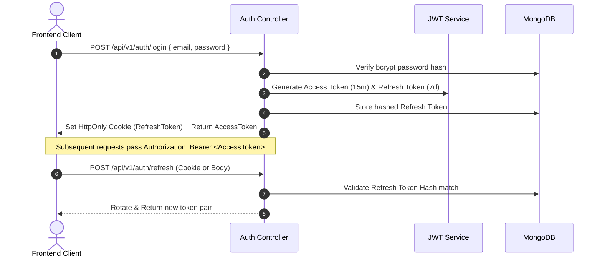

# 🌍 NomadAI — Production-Grade AI Travel Planner & Agentic Orchestrator

[](https://github.com/rishank-kesarwani/ai-travel-planner/actions)
[](https://www.typescriptlang.org/)
[](https://nextjs.org/)
[](https://nestjs.com/)
[](https://mongoosejs.com/)
[](https://redis.io/)
[](https://docs.bullmq.io/)

> **Flagship AI Application 1 of 9** in the Autonomous Engineering Portfolio.
> Engineered completely from scratch following decoupled microservice architectures, stateful LangGraph planning pipelines, verified vector RAG citations, and persistent user memory.

---

## 📑 Table of Contents
1. [Overview & Highlights](#-overview--highlights)
2. [High-Level Architecture (HLD)](#-high-level-architecture-hld)
3. [Low-Level Architecture (LLD)](#-low-level-architecture-lld)
4. [LangGraph AI Travel Planning Workflow](#-langgraph-ai-travel-planning-workflow)
5. [RAG Ingestion, Retrieval & Citations](#-rag-ingestion-retrieval--citations)
6. [Tool Calling Architecture](#-tool-calling-architecture)
7. [Authentication & Security Flow](#-authentication--security-flow)
8. [Database Schemas & Indexing](#-database-schemas--indexing)
9. [Redis Caching & Asynchronous BullMQ Queues](#-redis-caching--asynchronous-bullmq-queues)
10. [REST API Specification](#-rest-api-specification)
11. [Local Development & Quick Start](#-local-development--quick-start)
12. [Testing Strategy](#-testing-strategy)
13. [Docker & Containerized Deployment](#-docker--containerized-deployment)
14. [Production Hardening & Failure Handling](#-production-hardening--failure-handling)
15. [Environment Variables](#-environment-variables)

---

## 🌟 Overview & Highlights

NomadAI is a production-grade full-stack travel planner designed for modern explorers. The frontend communicates exclusively with the **Travel Planner NestJS Backend**, which acts as a secure domain gateway orchestrating database queries, caching, background workers, and calling the independent **AI Platform (`ai-platform`)**.



### Key Capabilities:
- 🚀 **Next.js App Router (v14+)**: Server & client components, TanStack Query hydration, React Hook Form with Zod validation.
- 🛡️ **NestJS Domain Backend**: Layered architecture, global exception filters, logging interceptors, and DTO validation pipes.
- ⚡ **Zero Direct AI Client Calls**: Eliminates token leakage; all LLM, embedding, and vector DB credentials stay isolated inside `ai-platform`.
- 🔄 **LangGraph Workflow Integration**: Multi-step stateful travel planning with automatic budget validation and re-planning feedback loops.
- 📚 **Grounded RAG with Citations**: Travel knowledge base and user history ingested asynchronously with strict source provenance (no hallucinations).
- 🧠 **Dynamic User Personalization & Memory**: Captures structured dietary, pace, and activity constraints directly from chat conversations.
- 📡 **Real-Time SSE Streaming**: Token-by-token chat completions with interactive stop, regenerate, and citation drawer.
- ⚡ **Asynchronous Non-Blocking Workers**: BullMQ queues handle vector document ingestion without delaying HTTP requests.

---

## 📐 High-Level Architecture (HLD)

The system enforces strict boundary isolation:
1. **Frontend Tier (Next.js)**: Responsible purely for rendering the user interface, client state hydration, and streaming event consumption.
2. **Domain Service Tier (NestJS)**: Enforces business logic, RBAC, short-lived JWT validation, Redis caching, BullMQ job dispatching, and travel tools execution.
3. **AI Platform Service (`ai-platform`)**: Reusable microservice managing Gemini LLM interaction, LangGraph execution, Qdrant vector retrieval, and user memory stores.



---

## 🧩 Low-Level Architecture (LLD)

### Backend Module Hierarchy
```
backend/src/
├── app.module.ts              # Root composition module
├── config/                    # Joi/Class-validator environment config
├── common/
│   ├── decorators/            # @CurrentUser(), @Roles(), @Public()
│   ├── filters/               # AllExceptionsFilter (standardized envelope)
│   ├── guards/                # JwtAuthGuard, RolesGuard, ServiceAuthGuard
│   ├── interceptors/          # LoggingInterceptor, TransformInterceptor
│   └── interfaces/            # AuthUser, ApiResponse, JwtPayload
└── modules/
    ├── auth/                  # JWT auth, refresh tokens, cookie handlers
    ├── users/                 # Profiles & travel preferences
    ├── destinations/          # Catalog search, Redis caching (1h TTL)
    ├── trips/                 # CRUD, budget aggregation, BullMQ triggers
    ├── favorites/             # User bookmarks & compound indexing
    ├── reviews/               # Ratings aggregation
    ├── weather/               # Redis-cached 5-day destination forecasts
    ├── tools/                 # Travel tools schemas & secure execution
    ├── ai-platform/           # AiPlatformClient, WorkflowService, AiChatService
    ├── queues/                # BullMQ producers & async indexing processors
    ├── redis/                 # Resilient Redis service with in-memory fallback
    └── health/                # MongoDB, Redis, AI Platform liveness checks
```

---

## 🤖 LangGraph AI Travel Planning Workflow

When a user requests a new itinerary, the Travel Backend invokes the LangGraph travel generator pipeline:



---

## 🔍 RAG Ingestion, Retrieval & Citations

### 1. Document Ingestion
When a user finishes a trip or saves custom travel guides, the document is tagged with metadata:
- `applicationId`: `"ai-travel-planner"`
- `userId`: Scoped for private trips (`visibility: 'private'`), omitted for public guides (`visibility: 'public'`).
- `category`: `'user_trip_history'` | `'destination_guides'` | `'safety_rules'`

### 2. Retrieval & Anti-Hallucination
Before answering travel inquiries, the assistant queries the vector index with metadata filters:
```json
{
  "applicationId": "ai-travel-planner",
  "userId": "usr_991823",
  "query": "Best vegetarian spots in Kyoto with moderate walking"
}
```

### 3. Citations UI
Every returned chunk includes explicit provenance rendered in the assistant drawer:
- `Kyoto Comprehensive Travel Guide` (*Verified Knowledge Base*)
- `Personal Trip Itinerary to Kyoto` (*User Memory Store*)

---

## 🛠️ Tool Calling Architecture

Domain tools are strictly owned and validated by the Travel backend. The AI Platform triggers them through `/api/v1/tools/execute` using secure `x-service-api-key` headers:

| Tool Name | Parameters | Purpose |
| :--- | :--- | :--- |
| `searchDestination` | `query, category, maxBudget` | Finds destinations matching traveler criteria |
| `getDestinationDetails` | `destination` | Fetches attractions, average daily cost, coordinates |
| `getWeather` | `location` | Fetches 5-day forecast and condition indices |
| `calculateBudget` | `destination, numberOfDays, travelers, budgetTier` | Calculates itemized hotel, food, and transit costs |
| `searchHotels` | `destination, style, budgetPerNightUsd` | Queries recommended accommodation styles |
| `searchActivities` | `destination, interests` | Retrieves top attractions filtered by interest tags |
| `getUserPreferences` | `userId` | Reads active dietary, walking, and budget profiles |
| `saveTrip` | `userId, destination, dates, budget, itinerary` | Persists finalized itinerary directly to MongoDB |

---

## 🔐 Authentication & Security Flow



---

## 🗄️ Database Schemas & Indexing

### Collections:
1. **`users`**
   - Fields: `name`, `email` (Unique Index), `passwordHash`, `role`, `preferences` (Sub-document), `refreshTokenHash`.
2. **`trips`**
   - Fields: `userId` (Ref User), `destination`, `startDate`, `endDate`, `numberOfDays`, `budget`, `currency`, `travelers`, `interests`, `preferences`, `itinerary` (DayPlan array), `status`, `totalEstimatedCostUsd`, `citations`.
   - **Indexes**: Compound index `{ userId: 1, createdAt: -1 }`, `{ destination: 1, status: 1 }`.
3. **`destinations`**
   - Fields: `name`, `slug` (Unique Index), `country`, `region`, `description`, `category`, `averageDailyCost`, `popularSeason`, `topAttractions`, `tags`, `coordinates`, `imageUrl`, `rating`.
   - **Indexes**: Text index on `{ name: 'text', description: 'text', country: 'text', tags: 'text' }`.
4. **`favorites`**
   - Fields: `userId`, `destinationId`.
   - **Indexes**: Unique compound index `{ userId: 1, destinationId: 1 }`.
5. **`reviews`**
   - Fields: `userId`, `destinationId`, `rating`, `comment`, `userName`, `visitedDate`.
   - **Indexes**: Index on `{ destinationId: 1, createdAt: -1 }`.

---

## ⚡ Redis Caching & Asynchronous BullMQ Queues

### Redis Key Namespaces:
- `destinations:list:<query_hash>` (TTL: 3600s)
- `destinations:item:<slug_or_id>` (TTL: 3600s)
- `weather:<location_slug>` (TTL: 1800s)

### BullMQ Queues:
1. **`trip-indexing`**: Ingests newly saved trip plans into AI Platform RAG vector stores.
2. **`external-api-sync`**: Synchronizes destination catalogues and seasonal exchange rates.
3. **`notifications`**: Dispatches traveler reminder events.

---

## 📡 REST API Specification

| Method | Endpoint | Access | Description |
| :--- | :--- | :--- | :--- |
| `POST` | `/api/v1/auth/register` | Public | Create new account & set refresh cookie |
| `POST` | `/api/v1/auth/login` | Public | Authenticate user & return JWT tokens |
| `POST` | `/api/v1/auth/refresh` | Public | Rotate access and refresh tokens |
| `POST` | `/api/v1/auth/logout` | User | Invalidate active refresh token |
| `GET` | `/api/v1/auth/me` | User | Get current authenticated user profile |
| `PATCH` | `/api/v1/users/preferences` | User | Update dietary, walking & budget preferences |
| `GET` | `/api/v1/trips` | User | List user trips with status pagination |
| `POST` | `/api/v1/trips` | User | Create a trip & trigger async BullMQ indexing |
| `GET` | `/api/v1/trips/:id` | User | Fetch trip details & daily timeline |
| `PATCH` | `/api/v1/trips/:id` | User | Update trip status or itinerary days |
| `DELETE` | `/api/v1/trips/:id` | User | Remove trip from user account |
| `GET` | `/api/v1/destinations` | Public | Search & filter destinations (Redis cached) |
| `GET` | `/api/v1/destinations/:id` | Public | Get destination details & attractions |
| `GET` | `/api/v1/weather` | Public | Get cached weather & 5-day outlook |
| `POST` | `/api/v1/ai/trips/generate` | User | Execute LangGraph Trip Planning Pipeline |
| `POST` | `/api/v1/ai/chat/stream` | User | Real-time SSE streaming assistant |
| `POST` | `/api/v1/ai/rag/query` | User | Direct vector RAG query with citations |
| `POST` | `/api/v1/tools/execute` | Service | Secure domain tool invocation callback |
| `GET` | `/api/v1/health` | Public | Microservice readiness & health checks |

---

## 🚀 Local Development & Quick Start

### Prerequisites
- Node.js v20+ or v22+
- Docker & Docker Compose (optional for full stack containers)
- MongoDB & Redis (or use docker-compose)

### 1. Clone & Setup Environment
```bash
git clone https://github.com/rishank-kesarwani/ai-travel-planner.git
cd ai-travel-planner

# Configure Backend .env
cp backend/.env.example backend/.env

# Configure Frontend .env
cp frontend/.env.example frontend/.env.local
```

### 2. Run Backend
```bash
cd backend
npm install --legacy-peer-deps
npm run start:dev
# Backend starts on http://localhost:4000
# Swagger API docs live at http://localhost:4000/api/docs
```

### 3. Run Frontend
```bash
cd frontend
npm install
npm run dev
# Frontend starts on http://localhost:3000
```

---

## 🧪 Testing Strategy

### 1. Run Backend Unit & Integration Tests
```bash
cd backend
npm test
```
Tests cover:
- `AuthService` (Password hashing, JWT generation, invalid credential handling)
- `TripsService` (Creation, budget aggregation, BullMQ job dispatching)
- `DestinationsService` (Redis caching validation, query filtering)
- `ToolsService` (Travel tool execution, schema compliance)
- `AiWorkflowService` (LangGraph workflow pipeline & citations verification)
- `RolesGuard` (Role-based access authorization)

### 2. Run Frontend Component Tests
```bash
cd frontend
npm test
```
Tests cover:
- Navbar brand rendering and authentication conditional routing
- Home Page hero CTA and architecture component validation

---

## 🐳 Docker & Containerized Deployment

Run the entire stack with a single command:
```bash
docker-compose up --build
```
This boots:
- `mongodb` on port `27017`
- `redis` on port `6379`
- `backend` (NestJS) on port `4000`
- `frontend` (Next.js) on port `3000`

---

## 🛡️ Production Hardening & Failure Handling

1. **Redis Degradation**: The `RedisService` automatically fails over to an in-memory TTL map if Redis goes offline, preventing server crashes.
2. **AI Platform Standby**: If `ai-platform` is unreachable, `AiWorkflowService` and `AiChatService` switch to local deterministic graph planning and contextual synthesis.
3. **Asynchronous RAG Ingestion**: BullMQ ensures slow vector embedding generation never blocks HTTP response cycles.
4. **Security Hardening**:
   - `Helmet` configured for HTTP headers protection.
   - Global `ValidationPipe` strips non-whitelisted request fields.
   - Throttler rate limits endpoints to prevent denial-of-service.
   - Identity derived strictly from authenticated JWT payload (`req.user`), never from body parameters.

---

## 🔑 Environment Variables Reference

### Backend (`backend/.env`):
| Variable | Description | Default |
| :--- | :--- | :--- |
| `PORT` | NestJS server port | `4000` |
| `FRONTEND_URL` | Allowed CORS origin | `http://localhost:3000` |
| `JWT_ACCESS_SECRET` | Secret key for access token signing | `[configured]` |
| `JWT_REFRESH_SECRET` | Secret key for refresh token signing | `[configured]` |
| `SERVICE_API_KEY` | Key for tool callback authorization | `travel_planner_internal_service_key_99182` |
| `MONGODB_URI` | MongoDB connection string | `mongodb://localhost:27017/ai-travel-planner` |
| `REDIS_HOST` | Redis host | `localhost` |
| `REDIS_PORT` | Redis port | `6379` |
| `AI_PLATFORM_URL` | AI Platform base URL | `http://localhost:5000` |
| `AI_PLATFORM_API_KEY` | Master API Key for AI Platform | `platform_master_key_dev_12345` |

### Frontend (`frontend/.env.local`):
| Variable | Description | Default |
| :--- | :--- | :--- |
| `NEXT_PUBLIC_API_URL` | Backend URL for client requests | `http://localhost:4000` |

---

## 🏆 Part of the Flagship AI Applications Portfolio
1. ✈️ **ai-travel-planner** *(Flagship)*
2. 🎬 *movie-night-matcher*
3. ⚽ *live-sports-tracker*
4. 📚 *campus-study-spot-finder*
5. 🪴 *habit-garden-tracker*
6. 🎵 *concert-festival-finder*
7. ☕ *coffee-shop-finder*
8. 🥾 *hiking-trail-explorer*
9. 📊 *personal-finance-dashboard*
